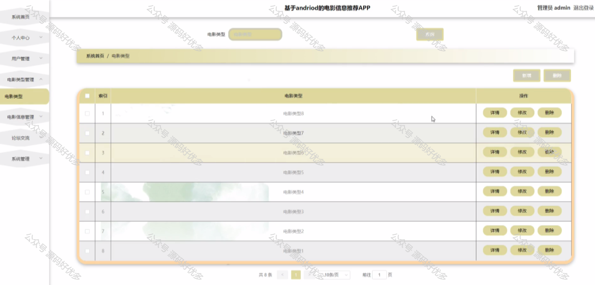

 
## 查看主页获取源码

> **作者介绍**： **✌**全网粉丝10W+本平台特邀作者、博客专家、CSDN新星计划导师、java领域优质创作者,博客之星、掘金/华为云/阿里云/InfoQ等平台优质作者、专注于项目实战 **✌**

  

### 一、作品包含

源码+数据库+设计文档万字+PPT+全套环境和工具资源+部署教程

### 二、项目技术

前端技术：Html、Css、Js、Vue、Element-ui

数据库：MySQL

后端技术：Java、Spring Boot、MyBatis

  

### 三、运行环境

开发工具：IDEA/eclipse + 微信开发者工具

数据库：MySQL5.7

数据库管理工具：Navicat10以上版本

环境配置软件： JDK1.8+Maven3.6.3

前端Nodejs：14

### 四、项目介绍
项目编号：mpweixinA031

在数字化浪潮的推动下，电影行业正经历着前所未有的变革，电影信息推荐小程序应运而生，成为连接用户与电影内容的重要桥梁。旨在探讨电影信息推荐小程序在提升用户观影体验、促进电影市场细分化和个性化服务中的作用、用户行为分析等方面的创新实践。通过对小程序的设计理念、推荐机制和市场影响的深入研究，本文旨在为电影行业的数字化转型提供理论支持和实践参考。

前台用户功能：浏览首页、电影信息、论坛交流、电影信息、我的收藏管理、我要发帖、我的发帖。

后台管理员的功能：系统首页、个人中心、用户管理、电影类型管理、电影信息管理、论坛交流、系统管理。

### 五、运行截图

  
